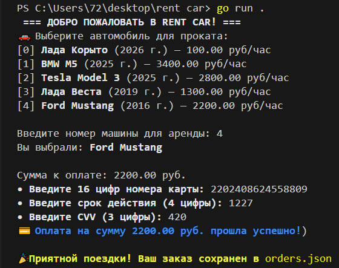

# 🚗 Rent Car System (CLI)

Консольное приложение на языке **Go** для автоматизации процесса аренды автомобилей. Проект демонстрирует навыки работы с объектно-ориентированным подходом (через структуры и методы), файловой системой и JSON-сериализацией.

## 🌟 Основные возможности
* **Автопарк**: Динамический список автомобилей с характеристиками (модель, год, цена).
* **Система оплаты**: Валидация банковских карт (номер, срок действия, CVV) через методы структур.
* **История заказов**: Автоматическое сохранение каждой успешной транзакции в файл `orders.json`.
* **Архитектура**: Четкое разделение кода на модели (`models.go`), логику хранения (`storage.go`) и интерфейс взаимодействия (`main.go`).

## 🛠 Технологический стек 
* **Language:** Go (Golang)
* **Data Format:** JSON
* **Standard Libs:** `fmt`, `encoding/json`, `os`, `time`, `errors`

## 📸 Скриншоты работы
Здесь представлены этапы работы программы:

### 1. Выбор автомобиля и ввод данных


### 2. Результат сохранения в JSON


## 🚀 Как запустить проект

1. Убедитесь, что у вас установлен [Go](https://go.dev/dl/) версии 1.20 или выше.
2. Клонируйте репозиторий:
   ```bash
   git clone [https://github.com/твой-логин/rent-car.git](https://github.com/Endropr/Rent-car-PET.git)
3. Перейдите в папку проекта:
   ```cd "rent car"
4. Запустите приложение:
   ```go run .
🏗 Структура проекта

    • main.go — точка входа, логика взаимодействия с пользователем.

    • models.go — описание структур данных (Car, Order, Card) и методов оплаты.

    • storage.go — функции для работы с файловой системой и JSON.

    • orders.json — база данных ваших заказов (генерируется автоматически).
### Проект разработан в рамках обучения Go для создания надежных бэкенд-систем.
